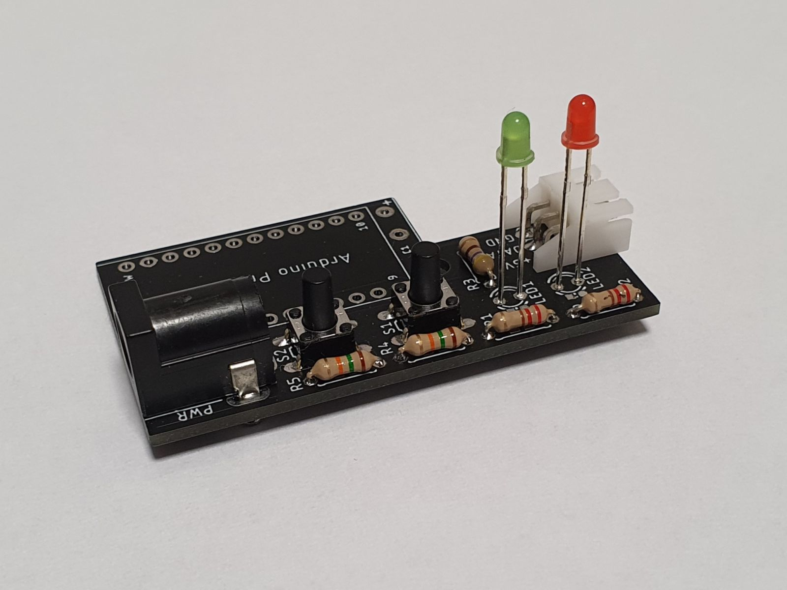
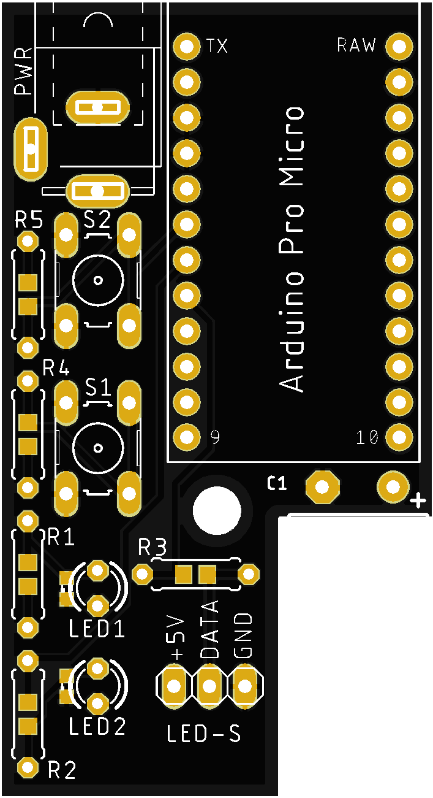
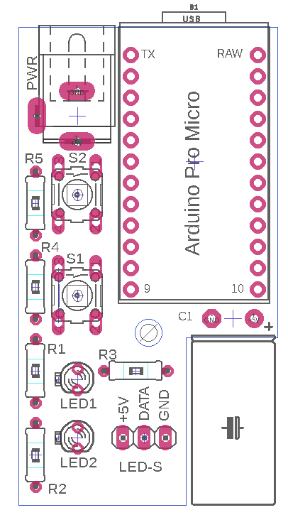

# MIDI2Neopixel - Piano LED Visualizer - Hardware

Electronic is built on **Arduino pro micro** (Atmega 32u4) which behave as MIDI output device. It could be powered from 5V DC adapter or directly from USB port (limited amperage) after soldering schottky diode between Arduino PWR pin and + terminal of capacitor. LEDs used in project are WS2812B (144 LEDs / 1 m).

 

PCB has place for SMD 0603 components or classic THT (You can select based on your supplies).

---
## Breadboard Example

---
## Schematic

## PCB

PCB was designed in Eagle 9.6.2:

 

