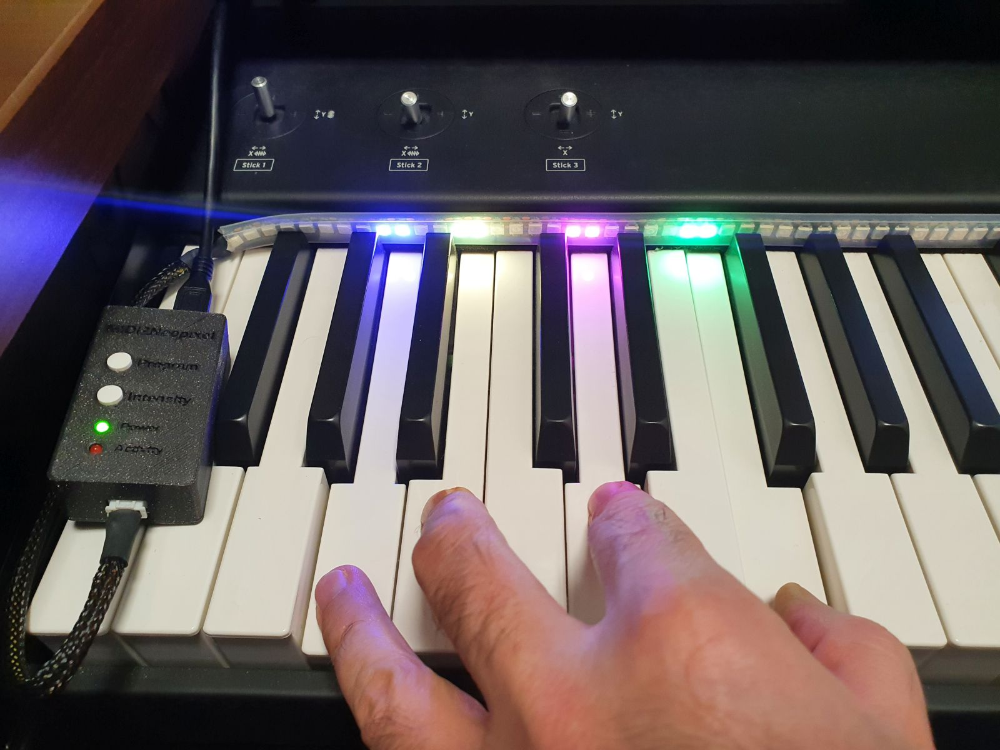
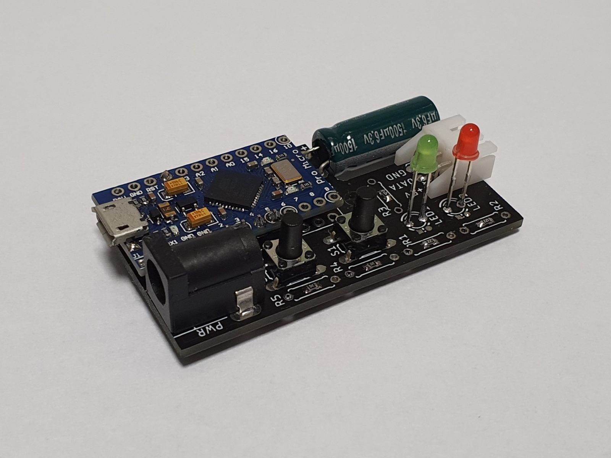
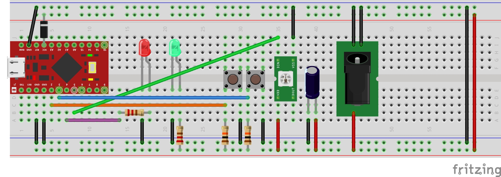
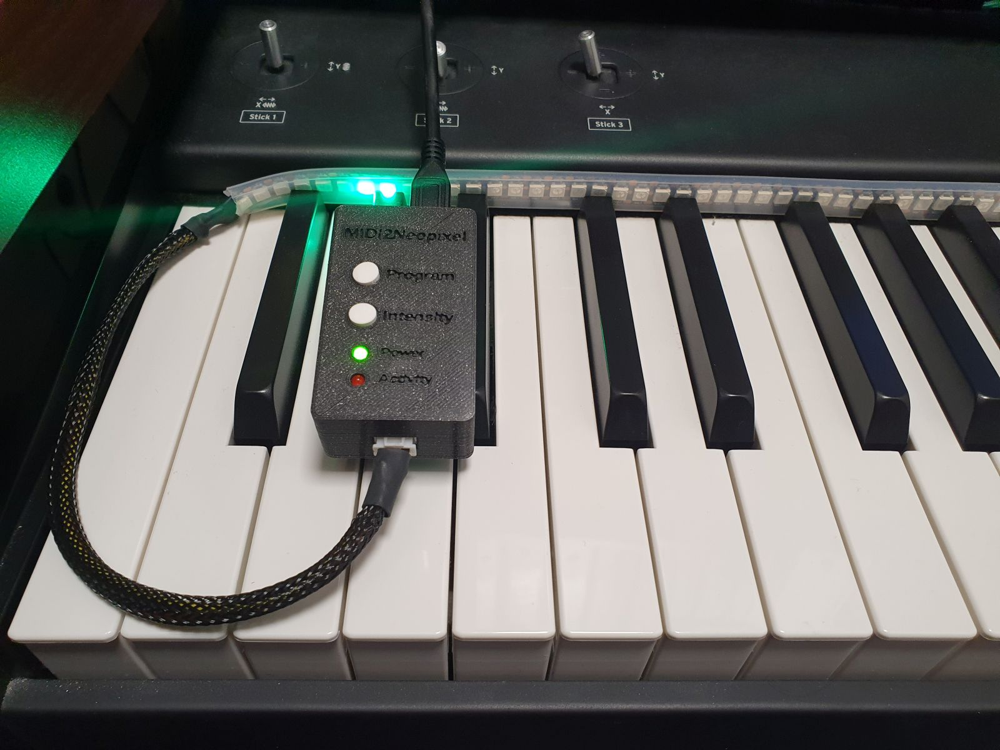
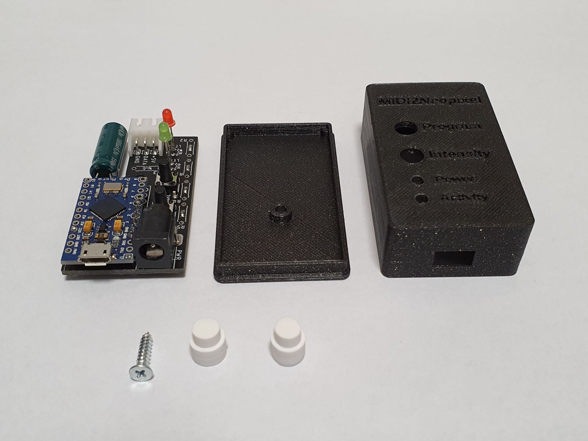

# MIDI2Neopixel - Piano LED Visualizer

MIDI2Neopixel is simple Piano LED Visualizer based on Arduino pro micro (Leonardo). It's compatible with [Synthesia](https://www.synthesiagame.com) piano learning software. 

In general, it could be also used with any music software allowing to define MIDI out device (e.g. NI Kontakt). 

## Hardware
 

See <a href="./Hardware">Hardware</a> README.md for more info.

## Software

See <a href="./Software">Software</a> README.md for more info.

## 3D printed parts

See <a href="./3D models">3D models</a> README.md for more info.
